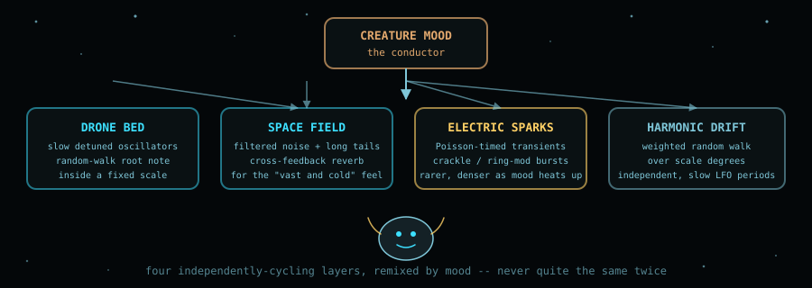
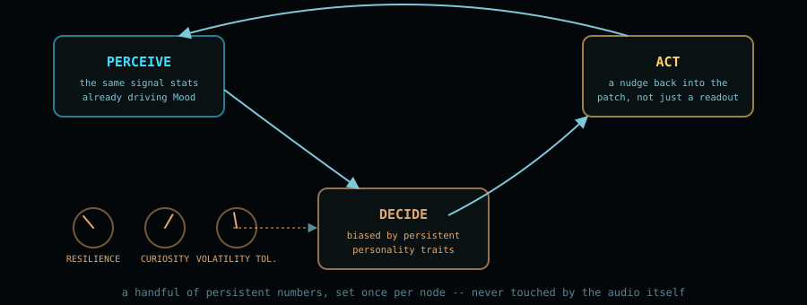
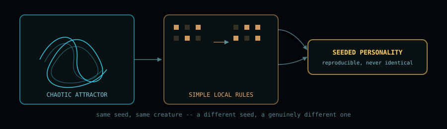

  

  
  
  
  

# Creature 🐾

**Creature** is a fork of [`soemdsp-sandbox`](https://github.com/soundemote/soemdsp-sandbox) exploring
a single question: *what would a virtual pet look like if it ate audio signal instead of food?*

It's a real patchable module — not a toy bolted on the side. Wire any signal into it and the
Creature tracks two independent stats, **Hunger** and **Health**, settles into exactly one of eight
moods at a time (picked by a small priority chain rather than a blended average), and — as of
`Ear Protect` — can act back into your patch instead of only reporting outward:

  

- **Peaceful** — quiet but fed, and steady. Sleepy, not starving.
- **Sad** — sitting outside the comfort band without anything sharper going on.
- **Happy** — settled, steady, and comfortably fed.
- **Excited** — a good signal just arrived right after a hungry stretch.
- **Hungry** — too quiet for too long, *or* fed inconsistently (loud, then silent, then loud again) even if the average level looks fine.
- **Angry** — sustained proximity to clipping. Hot for a while, not just a peak.
- **Fear** — an instantaneous spike at or near the clipping ceiling. The startle reflex.
- **Meltdown** — a genuinely *harsh* digital signal: riding the rails **and** jumping abruptly
  sample-to-sample (bitcrushed, hard-clipped, near-Nyquist square). A loud smooth sine never
  triggers this — only a signal that's actually broken does.

Feed it silence for long enough and Hunger climbs toward starvation; let Health run out and it's
gone for good. Feed it well and it recovers. The stakes are real, but tuned so stepping away from
your patch for a few minutes won't kill it — see [`native_modules/creature/creature.cpp`](native_modules/creature/creature.cpp)
for the exact thresholds.

## How it thinks

Everything lives in a single C++/WASM module — no JavaScript reimplementation, by design, for
compatibility with the rest of this sandbox's native-module architecture:

  

A handful of cheap running stats feed the mood decision every sample. The diagram shows the
original three readouts; `Alive` and `Ear Protect` (below) came later and tap the same analysis.

| Signal | What it tracks |
|---|---|
| `envelope` / level (dB) | how loud right now |
| steadiness (~1s) | is the level holding still, *right now* |
| baseline (~10s) | what level this creature has come to expect |
| clip heat | sustained time spent near the ceiling |
| onset energy | a positive jump back into the comfort zone |
| harshness | how abruptly the raw waveform jumps sample-to-sample |
| rail heat | how much time is spent pinned at full scale |

All of it is smoothed in **linear envelope space**, never directly in dB — dB is unbounded downward
(silence reads as -180dB), so a filter chasing a dB value after silence has to cross an enormous gap
before any comparison against it means anything. That bug (Hunger getting stuck and never recovering)
was one of two real ones caught by driving the compiled `.wasm` directly through `wasmtime`, outside
the browser entirely, before this was trusted as a working prototype.

## The goal

At its core this is meant to be a companion for making music, not just a gauge. The Creature should
recognize good listening conditions and reward them, not just tolerate them:

- **Happy when the signal is loud and clean** — comfortably filling the room without threatening
  the system playing it back.
- **Sleepy for smooth, spacious music.** Long reverb and delay tails, slow and steady, should read
  as restful rather than "too quiet." A Creature living with slow, spacious music should settle
  down, not get anxious about it.
- **Warmth is not danger.** Push the gain and a sine starts rounding off at the edges — soft,
  analog-style saturation, beautiful rounded squares. That's a different thing entirely from
  actually breaking: only once those rounded corners flatten out into a real square wave should it
  read as something wrong.
- **Meltdown has teeth.** ✅ *Implemented.* The Creature now has a fifth output, `Ear Protect`
  (0–1), that engages within ~200ms of a genuine Meltdown and releases gently over 1–2 seconds
  rather than chattering — a real gain-reduction request a downstream module can act on, not just a
  mood label. Verified directly against the compiled `.wasm`: clean at −12dB, snaps to `1.0` well
  before Meltdown even finishes latching in as the displayed mood, and eases back down as the
  signal calms. This is the first concrete instance of
  [Agentic personality](#agentic-personality)'s "acting back into the patch" idea, below.

The long-term goal is a companion that lives inside your patch and helps shape the music by mood —
quiet when you want quiet, warm when you want warmth, and genuinely protective when something's
about to hurt. Eventually, the same listening instincts built here could grow into something that
helps make music outright: **teaching a system to actually hear music, and use that hearing to help
build it — beautiful math, put to use.**

## Voice inspiration

Not implemented yet, but on the table: giving the Creature a voice that reacts to its mood instead
of (or alongside) the LCD readout. These two clips are reference material for what that could sound
like — click through to play:

- [`vocal-feedback.mp3`](docs/readme-assets/vocal-feedback.mp3)
- [`cute_robot.mp3`](docs/readme-assets/cute_robot.mp3)

## Generative ambient soundscape

Another idea on the table: a generative ambient layer for a spacey, electric world the Creature
could live in — not a fixed loop, but a small algorithmic ecosystem that the Creature's own mood
conducts.

  

The core idea in generative ambient work is to never let anything loop exactly — instead, run
several independent, slowly-cycling processes at once and let their combination drift out of phase
with itself indefinitely. A few concrete directions:

- **Drone bed** — a handful of detuned oscillators whose root note takes a slow random walk,
  constrained to a fixed scale so it always sounds intentional rather than random. `fractal_brownian_noise`
  and the existing oscillator modules in this sandbox are a natural fit for the walk itself.
- **Space field** — filtered noise and long cross-feedback reverb tails (`sabrina_reverb` already
  in this repo) for the "vast, cold, far away" feeling — mostly texture, rarely a distinct note.
- **Electric sparks** — sparse transient bursts on a Poisson-style random timer (rare, unevenly
  spaced events, not a steady pulse), using crackle/ring-modulation textures. Density and harshness
  scale with how "hot" the Creature's mood is running.
- **Harmonic drift** — a second, independent weighted random walk over scale degrees, cycling on a
  totally different period than the drone bed's walk, so the two only rarely line up.
- **Mood as conductor** — rather than hand-tuning a mix, map the Creature's own Hunger/Health/Mood
  outputs onto these layers' parameters directly: Peaceful thins everything out to near-silence and
  slows every LFO down; Angry/Fear pushes density and dissonance up; Meltdown could patch the
  electric-sparks layer through a bitcrusher and let it briefly dominate. The mood system already
  built for this module is, conveniently, already a mood *for* something — it's just never had a
  voice yet.
- **Silence as an instrument** — treat rests and near-silence as compositional choices, not gaps to
  fill. Ambient work reads as alive specifically because it isn't always doing something.

None of this is implemented yet — it's a direction, not a spec.

## Agentic personality

Mostly, the Creature still just reports what it senses — Hunger, Health, and Mood flow outward.
`Ear Protect` (above) is the first crack in that: an output that isn't a readout, it's a request. The
next idea is to grow that into a small closed loop of its own: **perceive → decide → act**, with a
persistent personality that colors every step, so two Creature nodes wired to the same signal don't
necessarily behave the same way.

  

- **A small trait set, not a personality engine.** A handful of persistent numbers — Resilience,
  Curiosity, Volatility Tolerance, Expressiveness — set once per node and never touched by the audio
  itself. They don't replace the mood priority chain, they bias its thresholds: a "resilient"
  instance shrugs off a clip spike that would send a "jumpy" one straight to Fear.
- **Adaptive expectation, not a fixed setpoint.** The comfort band is currently two fixed
  parameters. An agentic version could let the existing slow ~10-second baseline become the
  setpoint over a whole session, so a Creature fed quiet textures for an hour starts treating that
  as normal instead of forever comparing itself to a hardcoded number.
- **Acting back, not just reporting.** ✅ *First step implemented* — `Ear Protect`. Still open: a
  small nudge to its own sensitivity, a request-for-attention pulse when neglected, more of
  something shaped like an action rather than a readout.
- **Scarring, not just state.** Health already tracks the real stakes. A close call with death could
  leave a small permanent trait shift behind — more cautious afterward — rather than resetting
  cleanly the moment it recovers. History that outlives the event that caused it.
- **Kept honest.** The whole loop stays inside the same C++/WASM boundary as everything else here —
  no hidden external calls, no black box. Whatever "decides" is still a deterministic, inspectable
  function of state, just a slower and more personal one than the moment-to-moment mood chain.

Not implemented yet either — it's the next direction after the ambient work above.

## Ideas from chaos: life and automatons

[elanhickler/soemdsp-sandbox-digital-signals-audio](https://github.com/elanhickler/soemdsp-sandbox-digital-signals-audio)
already carries three native chaos modules worth borrowing ideas from: `logistic_map`, `henon_map`,
and `chua_attractor` — deterministic systems, fully reproducible from a starting condition, that
still never settle into an exact repeat. That's a different flavor of "alive" than a plain random
walk, and it fits both the [Agentic personality](#agentic-personality) and
[Ambient](#generative-ambient-soundscape) ideas above.

  

- **Personality that hatches from a seed, not a dice roll.** Feed one of these chaotic systems a
  starting value and its whole trajectory is fixed forever — but nudge that starting value by a
  hair and the long-term path diverges completely. A Creature's personality traits could come from
  exactly this: reproducible from a seed number, but two seeds a hair apart growing into
  noticeably different temperaments over a long session, neither one "wrong."
- **Emergent life from simple local rules.** A different, complementary idea: a small grid where
  each cell's next state depends only on its immediate neighbors, following a handful of fixed
  rules — no central plan, no lookahead, just local interaction repeated many times. Behavior that
  looks designed can emerge from rules that are almost embarrassingly simple. That's a promising
  model for the mood-priority chain evolving into something with more texture over time, without
  hand-authoring every case.
- **Chaos, kept honest.** All three of these are pure math — no randomness, no external calls, same
  seed always produces the same output. That matches the "kept honest" requirement already set for
  [Agentic personality](#agentic-personality): whatever ends up driving personality or mood texture
  should stay a deterministic, inspectable function of state.

Not implemented in the Creature yet — noted here because the building blocks already exist one repo
over.

## Status

Work in progress. The core module, mood logic, and both the offline and realtime signal paths are
wired up and verified directly against the compiled binary. Still open: more play-testing of the
mood thresholds against real patches, a proper LCD-style readout widget for the node itself (the
[DSEG](https://github.com/keshikan/DSEG) font is queued up for that), and possibly a voice.
