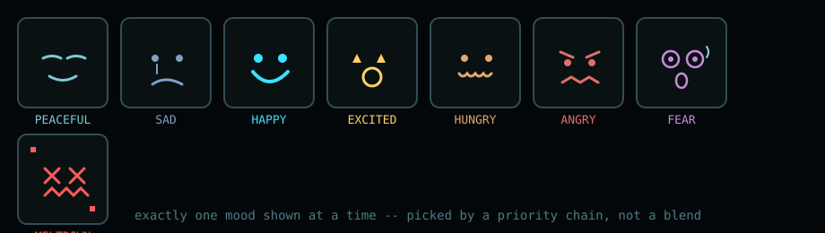
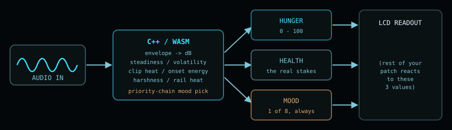

<p align="center">
  
</p>

<p align="center">
  
  
  
  
</p>

# Creature 🐾

**Creature** is a fork of [`soemdsp-sandbox`](https://github.com/soundemote/soemdsp-sandbox) exploring
a single question: *what would a Tamagotchi look like if it ate audio signal instead of food?*

It's a real patchable module — not a toy bolted on the side. Wire any signal into it and the
Creature tracks two independent stats, **Hunger** and **Health**, and settles into exactly one of
eight moods at a time, picked by a small priority chain rather than a blended average:

<p align="center">
  
</p>

- **Peaceful** — quiet but fed, and steady. Sleepy, not starving.
- **Sad** — sitting outside the comfort band without anything sharper going on.
- **Happy** — settled, steady, and comfortably fed.
- **Excited** — a good signal just arrived right after a hungry stretch.
- **Hungry** — too quiet for too long, *or* fed inconsistently (loud, then silent, then loud again) even if the average level looks fine.
- **Angry** — sustained proximity to clipping. Hot for a while, not just a peak.
- **Fear** — an instantaneous spike at or near the clipping ceiling. The startle reflex.
- **Meltdown** — a genuinely *harsh* digital signal: riding the rails **and** jumping abruptly
  sample-to-sample (bitcrushed, hard-clipped, near-Nyquist square). A loud smooth sine never
  triggers this — only a signal that's actually broken does.

Feed it silence for long enough and Hunger climbs toward starvation; let Health run out and it's
gone for good. Feed it well and it recovers. The stakes are real, but tuned so stepping away from
your patch for a few minutes won't kill it — see [`native_modules/creature/creature.cpp`](native_modules/creature/creature.cpp)
for the exact thresholds.

## How it thinks

Everything lives in a single C++/WASM module — no JavaScript reimplementation, by design, for
compatibility with the rest of this sandbox's native-module architecture:

<p align="center">
  
</p>

A handful of cheap running stats feed the mood decision every sample:

| Signal | What it tracks |
|---|---|
| `envelope` / level (dB) | how loud right now |
| steadiness (~1s) | is the level holding still, *right now* |
| baseline (~10s) | what level this creature has come to expect |
| clip heat | sustained time spent near the ceiling |
| onset energy | a positive jump back into the comfort zone |
| harshness | how abruptly the raw waveform jumps sample-to-sample |
| rail heat | how much time is spent pinned at full scale |

All of it is smoothed in **linear envelope space**, never directly in dB — dB is unbounded downward
(silence reads as -180dB), so a filter chasing a dB value after silence has to cross an enormous gap
before any comparison against it means anything. That bug (Hunger getting stuck and never recovering)
was one of two real ones caught by driving the compiled `.wasm` directly through `wasmtime`, outside
the browser entirely, before this was trusted as a working prototype.

## Inspirations

This module is a small tribute to three very different pieces of virtual-pet history:

- **[Creatures 3](https://en.wikipedia.org/wiki/Creatures_(video_game_series))** (CyberLife/Mindscape) —
  the reason "give a digital pet real stakes" felt worth doing at all. Its Norns run on an actual
  neural-net-and-biochemistry simulation, with true permadeath and no reload-to-cheat — the closest
  thing this hobby project has to a technical hero.
- **[Dogz](https://en.wikipedia.org/wiki/Petz)** (PF Magic) — proof that a virtual pet doesn't need deep
  simulation to earn affection; presentation and personality carry a huge amount of the feeling on
  their own.
- **[Tamagotchi](https://en.wikipedia.org/wiki/Tamagotchi)** (Bandai) — the whole reason Hunger and
  Health are two separate, unforgiving numbers instead of one soft "happiness" meter. Simple rules,
  real consequences, and people held actual funerals for these things in 1997.

None of their assets are reproduced here — every image above was drawn from scratch for this
project.

## Status

Work in progress. The core module, mood logic, and both the offline and realtime signal paths are
wired up and verified directly against the compiled binary. Still open: more play-testing of the
mood thresholds against real patches, and a proper LCD-style readout widget for the node itself
(the [DSEG](https://github.com/keshikan/DSEG) font is queued up for that).

---

# soemdsp-sandbox

## Live Demo: http://soundemote.io/sandbox

Browser sandbox for trying `soemdsp` patching, generated artifacts, waveform
views, Render Sample, and Live Audio.

## License

This repository is source-available for noncommercial use only. Commercial use
requires a separate written commercial license from Soundemote. See
[`LICENSE`](LICENSE).

```powershell
# Requirements:
# - Python 3
# - A modern browser
# No package install is required for the sandbox server.

# Download:
git clone https://github.com/soundemote/soemdsp-sandbox.git
cd soemdsp-sandbox

# Run:
python server.py

# Open:
# http://127.0.0.1:8765

# Stop:
# Ctrl+C

# Test:
python scripts\smoke_test.py
```

Optional artifact packet:

```powershell
# Use this only if the sibling soemdsp repo is built locally.
C:\Users\argit\Documents\_PROGRAMMING\soemdsp\build-moved\examples\Debug\runtime_dsp_object_bound_wav_resync_demo.exe
python server.py
```

Optional CLAP host prototype:

```powershell
# Localhost companion prototype for CLAP catalog and instance probes.
# Render Sample has a bounded CLAP bridge.
# Feedback touching CLAP nodes and Live Audio CLAP plans are blocked for now.
python tools\webui-clap-host\webui_clap_host.py

# Windows launcher, metadata inspection on by default:
tools\webui-clap-host\start_webui_clap_host.cmd
tools\webui-clap-host\start_webui_clap_host.ps1

# Optional alternate bind port:
python tools\webui-clap-host\webui_clap_host.py --port 48000
tools\webui-clap-host\start_webui_clap_host.cmd -Port 48000
tools\webui-clap-host\start_webui_clap_host.ps1 -Port 48000

# Optional explicit catalog entry:
python tools\webui-clap-host\webui_clap_host.py --plugin "C:\path\to\plugin.clap"

# Optional native descriptor inspection:
python tools\webui-clap-host\webui_clap_host.py --inspect-metadata

# Optional create/init/destroy probe:
python tools\webui-clap-host\webui_clap_host.py --test-instantiate

# Optional JSON preflight report without starting the server:
python tools\webui-clap-host\webui_clap_host.py --doctor --inspect-metadata

# In the sandbox browser:
# Edit the Host field if the companion is not using http://127.0.0.1:47991.
# Click Copy Host Command if you need the Windows .cmd launcher command.
# Click Connect Local Host.
# Click Diagnostics to read setup counts from the running host.
# Click Refresh Plugins to read the host catalog.
# Add a CLAP Plugin module to store a selected catalog entry.

# Prototype instance API:
# GET /health reports host capabilities.
# GET /health also reports hostConfig: bind host, port, Python executable, scan dirs, explicit plugins, and probe flags.
# GET /diagnostics reports hostConfig, catalog counts, metadata errors, instantiation errors, and missing explicit plugin paths.
# --doctor reports hostConfig, catalog counts, metadata errors, instantiation errors, and missing explicit plugin paths as JSON.
# Capabilities include maxProcessFrames, processBatch, and offlineRenderSessions.
# Current maxProcessFrames default is 48000.
# POST /instances
# GET /instances
# GET /instances/<id>/params
# POST /instances/<id>/param
# POST /instances/<id>/params
# GET /instances/<id>/editor
# POST /instances/<id>/editor/open
# POST /instances/<id>/editor/close
# GET /instances/<id>/latency
# GET /instances/<id>/tail
# GET /instances/<id>/state
# POST /instances/<id>/state
# POST /instances/<id>/render/begin
# POST /instances/<id>/process
# POST /instances/<id>/render/end
# POST /process-batch
# /process can accept and return bounded planar-f32-base64 audio.
# /process can apply a parameters array before processing the chunk.
# CLAP_PROCESS_ERROR fails the process call instead of returning audio.
# Direct /param and /params writes are blocked while a render session is active.
# Abandoned render sessions are released by an idle timeout.
# A second render/begin is rejected while a non-idle render session is active.
# Render Sample opens one render session per CLAP instance, processes chunks, then closes the session.
# Render Sample requires audioProcessing: true from the host.
# Render Sample requires offlineRenderSessions: true from the host.
# Render Sample uses maxProcessFrames for CLAP process chunk size.
# WebUI CLAP audio lanes flatten every CLAP audio port in host port order.
# CLAP editor status can be detected; supported Win32 clap.gui editors can open when the plugin accepts the GUI sequence.
# CLAP latency is compensated when Render Sample injects returned CLAP output.
# Finite CLAP tails can extend Render Sample up to the bounded tail limit; infinite tails remain metadata-only.
# CLAP state can be saved into patch JSON and restored into a new host instance when the plugin exposes clap.state.
# Reachable CLAP nodes are processed chunk-by-chunk in graph order.
# Independent CLAP nodes in the same chunk can share one batch request.
# POST /instances/<id>/safety/reset
# DELETE /instances/<id>
```

Guides:

```text
docs/ADDING_HARDCODED_SANDBOX_MODULE.md
docs/OSC_MODULE_NON_UI_REFERENCE.md
docs/WEBUI_CLAP_HOST_PLAN.md
tools/webui-clap-host/README.md
```

Boundaries:

```text
The server only writes through explicit save/settings/audio helper routes.
Open Path is restricted to Downloads.
The browser patch graph is demo-scoped state.
The browser compiler is not the production soemdsp scheduler.
The WebUI does not instantiate real C++ DSP objects yet.
Patch files can save current module instances and settings.
Patch files cannot define new module types by themselves.
```
